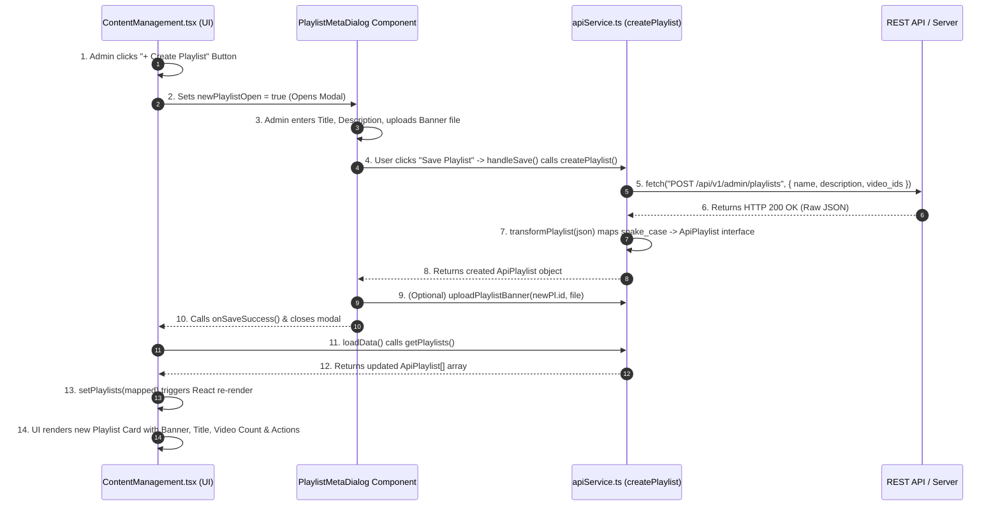

# Technical Documentation & System Explanation
## TalentSea Content & OTT Admin Dashboard

---

## 1. Executive Summary & Architecture Overview

The **TalentSea Admin Dashboard** is an enterprise-grade, high-performance web application designed for content creators, media managers, and OTT platform administrators. It provides end-to-end management of video assets, HLS stream playback, playlist organization, audience community moderation, financial reporting, and white-label mobile/desktop application branding.

### Core Technology Stack

| Layer | Technology Used | Purpose |
| :--- | :--- | :--- |
| **Framework & Build** | React 18 + Vite 6 | Lightning-fast HMR dev server & production bundling |
| **Language** | TypeScript | Strong static typing across API contracts & UI state |
| **Routing** | React Router v7 | Declarative browser routing (`createBrowserRouter`) |
| **Styling & Theme** | TailwindCSS + Vanilla CSS (`theme.css`) | Custom **Dark Studio** glassmorphism design system |
| **Component Primitives** | Radix UI (`@radix-ui/react-*`) | Accessible headless UI components (Dialogs, Selects, Tabs) |
| **Video Streaming** | HLS.js (`hls.js`) + WebVTT | HTTP Live Streaming playback with embedded captions |
| **Chunked Video Upload** | Tus-js-client (`tus-js-client`) | Resumable, multi-part video uploads directly to CDN |
| **Data Visualization** | Recharts (`recharts`) | Interactive Area, Bar, and Line charts for analytics |
| **Icons** | Lucide React (`lucide-react`) | Modern, consistent SVG vector iconography |

---

## 2. Deep Dive: Playlist Feature Lifecycle — UI Buttons, API Execution, Response & Rendering

This section explains **where the playlist buttons are located, what happens when clicked, how the API processes the request, and how the UI updates and renders**.



---

### Step 1: Where are the Playlist UI Buttons Located?

In `src/app/pages/ContentManagement.tsx`:

1. **Header Toolbar Button (`+ Create Playlist`)**:
   - Located at top-right when viewing the Content Management page.
   - **Code**:
     ```tsx
     <Button
       className="gap-2 bg-purple-600 hover:bg-purple-500 text-white font-semibold shadow-lg shadow-purple-600/20"
       onClick={() => setNewPlaylistOpen(true)}
     >
       <Plus className="h-4 w-4" /> Create Playlist
     </Button>
     ```

2. **Playlist Grid Card Click (`View / Manage Playlist`)**:
   - Located on every playlist card in the Playlists tab.
   - **Code**:
     ```tsx
     <Card
       className="cursor-pointer border-slate-800 hover:border-purple-500/50 transition-all bg-slate-950/60"
       onClick={() => setActivePlaylist(playlist)}
     >
       {/* Renders Playlist Banner, Title, Video Count Badge */}
     </Card>
     ```

3. **Video Action Dropdown (`Add to Playlist`)**:
   - Located in the dropdown menu of individual video items (`SelectPlaylistDialog`).

---

### Step 2: What Happens After Clicking "+ Create Playlist"?

1. **Modal Opens**: Clicking "+ Create Playlist" sets React state `newPlaylistOpen = true`.
2. **Dialog Rendered**: `<PlaylistMetaDialog open={newPlaylistOpen} onClose={() => setNewPlaylistOpen(false)} allVideos={contents} onSaveSuccess={loadData} />` appears on screen.
3. **Admin Input**: The admin inputs:
   - **Title**: e.g., `"Complete React Masterclass"`
   - **Description**: e.g., `"All videos covering React 18, hooks, and state management"`
   - **Banner Image**: File upload dropzone (`bannerFileRef`)
   - **Select Videos**: Opens child `<AddVideosDialog />` to pick initial videos.
4. **Submit Action**: Admin clicks **"Save Playlist"**, triggering `handleSave()`.

---

### Step 3: How the API Call is Executed

Inside `PlaylistMetaDialog` (`ContentManagement.tsx`, Lines 1127–1149):

```ts
const handleSave = async () => {
  if (!title.trim()) return;
  setSubmitting(true);
  try {
    // 1. Invoke API Service Function
    const newPl = await createPlaylist({ title, description, videoIds });

    // 2. If user attached a banner image file, upload it immediately
    if (newPl && newPl.id && bannerFileRef.current?.files?.[0]) {
      await uploadPlaylistBanner(newPl.id, bannerFileRef.current.files[0]);
    }

    // 3. Trigger success callback & close modal
    onSaveSuccess();
    onClose();
  } catch (err) {
    console.error("Failed to save playlist:", err);
  } finally {
    setSubmitting(false);
  }
};
```

#### API Service Code (`src/app/services/apiService.ts`, Lines 526–545):
```ts
export async function createPlaylist(data: {
  name?: string;
  title?: string;
  description?: string;
  videoIds?: number[];
  video_ids?: number[];
}): Promise<ApiPlaylist> {
  const nameVal = data.name || data.title || "Untitled Playlist";
  const res = await fetch(`${BASE_URL}/api/v1/admin/playlists`, {
    method: "POST",
    headers: getAuthHeaders(), // Authorization: Bearer <token>
    body: JSON.stringify({
      name: nameVal,
      description: data.description || "",
      video_ids: data.video_ids || data.videoIds || [],
    }),
  });
  const json = await handleResponse<any>(res);
  return transformPlaylist(json);
}
```

---

### Step 4: How the Backend Responds & Data Transformation

1. **Backend Output**: Server returns HTTP `200 OK` with raw JSON:
   ```json
   {
     "id": 12,
     "name": "Complete React Masterclass",
     "description": "All videos covering React 18...",
     "video_count": 4,
     "video_ids": [101, 102, 103, 104],
     "thumbnail_url": "https://cdn.talentsea.com/banners/playlist_12.jpg",
     "created_at": "2026-08-15T12:00:00Z"
   }
   ```
2. **Data Normalization (`transformPlaylist`)**:
   `apiService.ts` converts backend `snake_case` fields to `camelCase` TypeScript `ApiPlaylist` properties:
   ```ts
   function transformPlaylist(raw: any): ApiPlaylist {
     const nameVal = raw.name || raw.title || "Untitled Playlist";
     return {
       id: raw.id ?? raw.playlist_id,
       name: nameVal,
       title: nameVal,
       description: raw.description || "",
       videoCount: raw.video_count ?? raw.videoCount ?? (raw.video_ids ? raw.video_ids.length : 0),
       videoIds: raw.video_ids || raw.videoIds || [],
       date: raw.created_at ? raw.created_at.split("T")[0] : raw.date,
       thumbnailUrl: raw.thumbnail_url || raw.banner_image_url || raw.thumbnailUrl,
     };
   }
   ```

---

### Step 5: How the UI Receives the Response & Renders

1. **Callback Triggers**: `onSaveSuccess()` executes in `ContentManagement.tsx`.
2. **Re-fetching Playlists**: `loadData()` calls `getPlaylists()`.
3. **State Update**:
   ```ts
   const pRes = await getPlaylists();
   setPlaylists(pRes.data);
   ```
4. **Modal Closes & Toast Shown**: `setNewPlaylistOpen(false)` closes the modal and a notification toast displays: `"Playlist created successfully"`.
5. **UI Rendering**:
   - React updates the DOM to show the new **Playlist Card**:
     - **Header/Banner**: Thumbnail image (`thumbnailUrl`).
     - **Title & Subtitle**: `"Complete React Masterclass"`.
     - **Badge**: `"4 Videos"`.
     - **Action Menu**: `Edit Metadata`, `Manage Videos`, `Delete Playlist`.

---

### Step 6: What Happens When Clicking a Playlist Card (`PlaylistDetailScreen`)

When an admin clicks on any Playlist Card (`onClick={() => setActivePlaylist(playlist)}`):
1. **Screen Switch**: The UI switches from Playlist Grid view to **`PlaylistDetailScreen`**.
2. **Fetching Playlist Videos**: `getPlaylistVideos(playlist.id)` fetches all videos belonging to this playlist (`GET /api/v1/admin/playlists/:id/videos`).
3. **YouTube-Style Management UI Rendered**:
   - **Reorder Videos**: Click **Up / Down** arrows on video rows ➔ triggers `reorderPlaylistVideos` API.
   - **Add More Videos**: Click **"+ Add Videos"** button ➔ opens `AddVideosDialog` and calls `addVideosToPlaylist`.
   - **Remove Videos**: Check multi-select checkboxes + click **"Remove Selected"** ➔ calls `bulkRemoveVideosFromPlaylist`.
   - **Change Banner**: Click **"Change Banner"** ➔ calls `uploadPlaylistBanner`.

---

## 3. Design System & Aesthetics ("Dark Studio Theme")

The application implements a tailored **"Dark Studio"** design system defined in `src/styles/theme.css`.

### Visual Principles
1. **Background Palette**: Deep space obsidian tones (`#0b0f19`, `slate-950`, `slate-900/60`).
2. **Glassmorphism**: Backdrop blur filters (`backdrop-blur-xl`), subtle translucent borders (`border-slate-800/80`), and high-depth box shadows (`shadow-2xl`).
3. **High-Contrast Legibility**: Standardized slate text hierarchy (`text-white`, `text-slate-300`, `text-slate-400`).
4. **Accent & Focus Rings**: Purple focus indicator (`ring-purple-500/50` / `#a855f7`) with 1px offset to eliminate white focus flashes.

---

## 4. Directory & File Structure

```
admin/website/
├── public/                     # Static public assets
├── src/
│   ├── main.tsx                # Application mounting & React DOM render
│   ├── styles/
│   │   ├── index.css           # Global Tailwind directives & font imports
│   │   └── theme.css           # Dark Studio CSS variables & focus ring overrides
│   └── app/
│       ├── App.tsx             # RouterProvider configuration wrapper
│       ├── routes.tsx          # Central route definitions & route guards
│       ├── components/
│       │   ├── AdminLayout.tsx         # Main layout (Sidebar navigation & Header bar)
│       │   ├── ApiResponseMonitor.tsx  # Developer API network monitoring drawer
│       │   └── ui/                     # Reusable UI primitives (Button, Dialog, etc.)
│       ├── services/
│       │   ├── apiService.ts           # Core REST API service & data transformers
│       │   └── apiMonitorService.ts    # Store & event emitter for real-time network logs
│       └── pages/
│           ├── Dashboard.tsx           # Platform performance overview & top assets
│           ├── ContentManagement.tsx   # Video library, upload wizard, playlists & HLS player
│           ├── Community.tsx           # Announcements & multi-level comment moderation
│           ├── Analytics.tsx           # Detailed views, watch-time & demographic charts
│           ├── Subscribers.tsx         # Audience member management & tier filters
│           ├── Categories.tsx          # Video content taxonomy & tag manager
│           ├── SubscriptionPlans.tsx   # Monetization tier configuration
│           ├── Branding.tsx            # Live app preview & visual identity customization
│           ├── Revenue.tsx             # Earnings breakdown & transaction ledger
│           ├── Settings.tsx            # Admin profile, security & notification settings
│           └── Login.tsx               # Authenticated entry gate & session setup
├── index.html                  # HTML5 entry document
├── package.json                # Project metadata & npm dependencies
├── vite.config.ts              # Vite server & bundler configuration
└── EXPLANATION.md              # Technical documentation (This file)
```
