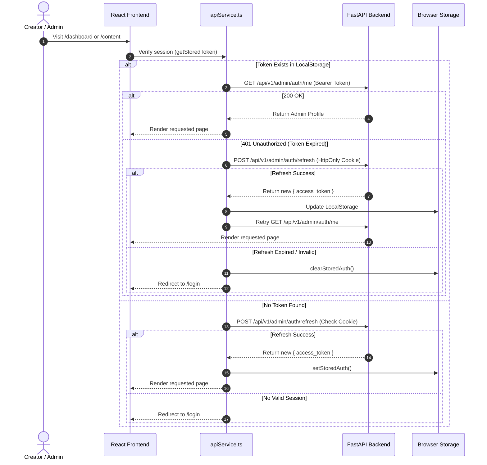
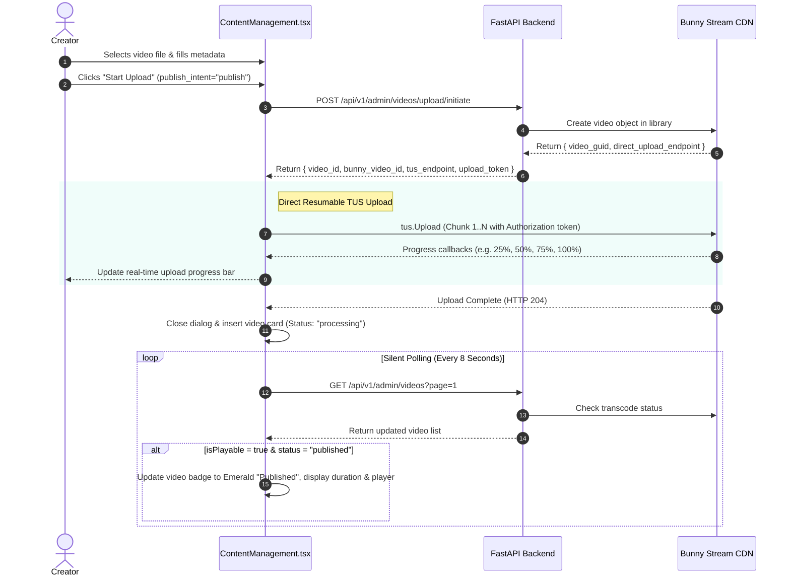
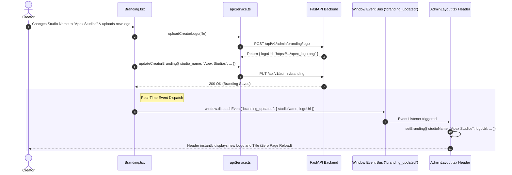

# TalentSea White-Label Platform: Complete Website Flow, API Architecture & Rendering Guide

This guide provides a comprehensive, single-source explanation of the **TalentSea Admin Portal** (`admin/website`). It details every aspect of the application: from initial authentication, route transitions, and UI component rendering, down to the exact backend REST API endpoints, request/response data transformers, and background lifecycle behaviors.

---

## Table of Contents
1. [Platform Architecture & Rendering Engine](#1-platform-architecture--rendering-engine)
   - [Technology Stack](#11-technology-stack)
   - [Bootstrapping & Route Hierarchy](#12-bootstrapping--route-hierarchy)
   - [The Bress Design System](#13-the-bress-design-system)
   - [State Management & Live Event Bus](#14-state-management--live-event-bus)
   - [API Client & Authentication Interceptor](#15-api-client--authentication-interceptor)
   - [Real-Time Lifecycle & Silent Polling](#16-real-time-lifecycle--silent-polling)
2. [End-to-End User Flow & Page-by-Page Walkthrough](#2-end-to-end-user-flow--page-by-page-walkthrough)
   - [Screen 0: Authentication & Session Gatekeeping (`/login`)](#screen-0-authentication--session-gatekeeping-login)
   - [Screen 1: Global Admin Shell & Sidebar (`AdminLayout`)](#screen-1-global-admin-shell--sidebar-adminlayout)
   - [Screen 2: Dashboard (`/`)](#screen-2-dashboard-)
   - [Screen 3: Content Management & Video Engine (`/content`)](#screen-3-content-management--video-engine-content)
   - [Screen 4: Subscribers Roster (`/subscribers`)](#screen-4-subscribers-roster-subscribers)
   - [Screen 5: Subscription Plans & Pricing (`/plans`)](#screen-5-subscription-plans--pricing-plans)
   - [Screen 6: Deep Analytics & Telemetry (`/analytics`)](#screen-6-deep-analytics--telemetry-analytics)
   - [Screen 7: Revenue, Settlements & Bank Payouts (`/revenue`)](#screen-7-revenue-settlements--bank-payouts-revenue)
   - [Screen 8: Community Moderation & Engagement (`/community`)](#screen-8-community-moderation--engagement-community)
   - [Screen 9: Creator Branding & App Customization (`/branding`)](#screen-9-creator-branding--app-customization-branding)
   - [Screen 10: Category Taxonomy (`/categories`)](#screen-10-category-taxonomy-categories)
   - [Screen 11: Settings & Creator Profile (`/settings`)](#screen-11-settings--creator-profile-settings)
3. [Master API Endpoint Reference Matrix](#3-master-api-endpoint-reference-matrix)
4. [Architectural Sequence Diagrams](#4-architectural-sequence-diagrams)
   - [A. Authentication & Session Verification](#a-authentication--session-verification-flow)
   - [B. Video Upload, TUS Protocol & Transcoding Pipeline](#b-video-upload-tus-protocol--transcoding-pipeline)
   - [C. Dynamic Branding Event Bus](#c-dynamic-branding-event-bus)

---

## 1. Platform Architecture & Rendering Engine

### 1.1 Technology Stack
The frontend is structured as a high-performance Single Page Application (SPA) optimized for creator administration:
- **Core Runtime**: React 18.3+ with TypeScript
- **Bundler & Build Tool**: Vite 6+ with Hot Module Replacement (HMR) and Rollup code-splitting
- **Routing**: React Router v7 (`createBrowserRouter`, `<RouterProvider>`, `<Outlet />`, `useNavigate`, `useLocation`)
- **Styling**: Tailwind CSS with custom utility classes, CSS custom properties, and Bress light-theme tokens
- **Iconography**: Lucide React (`lucide-react`)
- **Charts & Telemetry**: Recharts (`ResponsiveContainer`, `AreaChart`, `BarChart`, `PieChart`, `Tooltip`)
- **Video Playback**: HLS.js / HTML5 native video with WebVTT subtitle track rendering
- **Upload Protocol**: TUS Protocol client (`tus-js-client`) for direct resumable streaming uploads to Bunny CDN

### 1.2 Bootstrapping & Route Hierarchy
Execution begins at `admin/website/src/main.tsx`:
1. `main.tsx` mounts the React root to `<div id="root"></div>`.
2. It renders `src/app/App.tsx`, which mounts the router via `<RouterProvider router={router} />`.
3. The routing declaration (`src/app/routes.tsx`) defines the application structure:

```
[ Router Configuration ]
├── /login ──> <Login /> (Standalone, unauthenticated canvas)
└── /      ──> <AdminLayout /> (Persistent Shell, Auth Guard, Sidebar, Topbar)
    │           ├── ErrorBoundary: <RouteErrorBoundary />
    │
    ├── (index)    ──> <Dashboard />
    ├── /content   ──> <ContentManagement />
    ├── /subscribers ──> <Subscribers />
    ├── /plans     ──> <SubscriptionPlans />
    ├── /analytics ──> <Analytics />
    ├── /revenue   ──> <Revenue />
    ├── /community ──> <Community />
    ├── /branding  ──> <Branding />
    ├── /categories ──> <Categories />
    └── /settings  ──> <Settings />
```

If a runtime JavaScript or rendering error occurs within any page, `RouteErrorBoundary` catches the exception and renders a structured fallback card with "Reload Screen" and "Go to Dashboard" actions without crashing the whole application shell.

### 1.3 The Bress Design System
The application is styled according to the **Bress Design System**:
- **Palette**: Clean, crisp white workspaces (`bg-[#F8FAFC]` and `bg-white`), high-contrast dark slate text (`text-slate-900`), and subtle neutral borders (`border-slate-200/80`).
- **Cards & Surfaces**: Flat cards with delicate `shadow-xs` or `shadow-sm`, rounded corners (`rounded-xl` or `rounded-2xl`), avoiding heavy gradients or skeuomorphic shadows.
- **Badges & State Indicators**:
  - `Published`: `bg-emerald-50 text-emerald-700 border-emerald-200`
  - `Scheduled`: `bg-blue-50 text-blue-700 border-blue-200`
  - `Processing` / `Transcoding`: `bg-amber-50 text-amber-700 border-amber-200`
  - `Draft`: `bg-slate-100 text-slate-700 border-slate-200`
- **Typography**: Inter / system font stack with clear tabular numbers and legible small-print metadata (`text-xs text-slate-500`).

### 1.4 State Management & Live Event Bus
State is managed hierarchically using native React primitives:
1. **Local Page State**: Managed via `useState`, `useReducer`, and `useMemo` for filters, tabs, search terms, and dialog visibility.
2. **Storage Persistence**:
   - `admin_access_token`: Stored in `localStorage` for JWT authorization.
   - `admin_profile`: Stored in `localStorage` for immediate user avatar and name rendering.
   - `sidebar_collapsed`: Stored in `localStorage` to preserve sidebar width state across page reloads.
3. **Cross-Component Live Event Bus**:
   - When the creator updates studio branding or logo in `Branding.tsx`, it dispatches a window event:
     `window.dispatchEvent(new CustomEvent("branding_updated", { detail: updatedBranding }))`.
   - `AdminLayout.tsx` listens to this event and instantly updates the header logo, studio name, and tagline without requiring a page refresh.

### 1.5 API Client & Authentication Interceptor
All backend communications are routed through `src/app/services/apiService.ts`:
- **Base URL Detection (`getBaseUrl`)**:
  - In local development (`localhost`, `127.0.0.1`), it returns an empty string `""` so requests flow through Vite's reverse proxy (`vite.config.ts`), eliminating CORS headers and ngrok interstitial pages.
  - In production / HTTPS environments, it respects `VITE_API_BASE_URL`.
- **Authenticated Fetch Wrapper (`fetchWithAuth`)**:
  - Automatically attaches the `Authorization: Bearer <token>` header.
  - Injects `ngrok-skip-browser-warning: true` to bypass proxy interstitials.
  - **Auto-Refresh Interceptor**: If the API returns HTTP 401 Unauthorized, `fetchWithAuth` pauses the request, invokes `adminRefresh()` (`POST /api/v1/admin/auth/refresh` using the HttpOnly cookie), updates the stored token, and automatically retries the original request. If refresh fails, it clears credentials and redirects the user to `/login`.

### 1.6 Real-Time Lifecycle & Silent Polling
- For long-running asynchronous tasks (such as Bunny Stream video encoding/transcoding), the UI avoids locking the user with blocking spinners.
- In `ContentManagement.tsx`, an 8-second polling timer triggers `fetchVideosSilently()`. This updates the video card progress bar, duration, status badges, and playback availability in-place without resetting scroll position or causing UI flickers.

---

## 2. End-to-End User Flow & Page-by-Page Walkthrough

```
[ User Visit ] ──> /login ──> [ Authenticated? ] 
                                  ├── No  ──> [ Login Form ] ──> POST /auth/login ──┐
                                  └── Yes ──> [ AdminLayout Shell ] <───────────────┘
                                                    │
        ┌──────────────┬──────────────┬─────────────┼──────────────┬──────────────┐
        ▼              ▼              ▼             ▼              ▼              ▼
   / (Dashboard)   /content     /subscribers     /plans       /analytics       /revenue
        │              │              │             │              │              │
        ▼              ▼              ▼             ▼              ▼              ▼
   /community     /branding     /categories     /settings     Profile Modal   Logout
```

---

### Screen 0: Authentication & Session Gatekeeping (`/login`)
- **Route**: `/login`
- **Component**: `src/app/pages/Login.tsx`
- **Visual Design**:
  - Split-screen layout.
  - Left panel: Interactive animated illustration (`CreativeLoginCharacters.tsx`) that reacts visually to focus events on the email and password inputs.
  - Right panel: Bress card with email, password, and "Remember me" toggle.
- **Flow**:
  1. User enters Email and Password and clicks "Sign in".
  2. UI enters a loading state (`isSubmitting = true`).
  3. Executes `adminLogin({ email, password })` calling `POST /api/v1/admin/auth/login`.
  4. Upon `200 OK`:
     - Access token is saved via `setStoredAuth({ access_token, admin })`.
     - Browser receives the refresh token in an `HttpOnly` cookie.
     - Navigates to `/` (or the previous target URL saved in `location.state.from`).
  5. Upon error: A red error alert is displayed with server message details.

---

### Screen 1: Global Admin Shell & Sidebar (`AdminLayout`)
- **Component**: `src/app/components/AdminLayout.tsx`
- **Scope**: Wraps all authenticated routes (`/`, `/content`, `/subscribers`, etc.)
- **Key Responsibilities**:
  1. **Session Gatekeeper**:
     - On mount, reads `getStoredToken()`.
     - Calls `adminGetMe()` (`GET /api/v1/admin/auth/me`).
     - If the token is missing or expired, it automatically calls `adminRefresh()`. If that fails, it redirects to `/login`.
  2. **Collapsible Sidebar**:
     - 10 primary navigation links with active state highlighting (`bg-slate-900 text-white` vs `text-slate-600 hover:bg-slate-100`).
     - Expand/collapse toggle button that persists width state (`w-64` vs `w-20`) in `localStorage.sidebar_collapsed`.
  3. **Header Topbar**:
     - Displays studio logo and brand name (auto-refreshed via `branding_updated` event).
     - Global search bar.
     - Notification bell dropdown with mark-as-read toggles.
     - Creator Avatar dropdown with quick links to "View Profile", "Settings", and "Sign Out".
  4. **Profile Quick-Edit Modal**:
     - Accessible from the avatar dropdown.
     - Fetches `getCreatorProfile()` and `getDashboardStats()`.
     - Displays creator video count, total views, and subscribers.
     - Allows instant updates to name, phone, bio, and location via `updateCreatorProfile()`.
  5. **API Response Monitor**:
     - Floating developer drawer (`ApiResponseMonitor.tsx`) tracking all background network calls, HTTP statuses, and latencies in real time.

---

### Screen 2: Dashboard (`/`)
- **Route**: `/`
- **Component**: `src/app/pages/Dashboard.tsx`
- **APIs Consumed**:
  - `GET /api/v1/admin/dashboard/stats?range=30d`
  - `GET /api/v1/admin/dashboard/analytics?range=30d&interval=day`
  - `GET /api/v1/admin/dashboard/subscription-breakdown?range=30d`
  - `GET /api/v1/admin/dashboard/recent-activity?filter=all&page=1&limit=8`
  - `GET /api/v1/admin/videos?limit=5`
- **Key Features & Rendering**:
  1. **5 KPI Metric Cards**:
     - Total Revenue (with % change comparison against previous period).
     - Total Views (with growth indicator).
     - Active Subscribers.
     - Total Registered Users.
     - Content Inventory Breakdown: Total videos with published, draft, and scheduled counts.
  2. **Interactive Telemetry Chart**:
     - Recharts area chart with tabs to toggle between Views, Revenue, Subscribers, and Users.
     - Range selector: 7 days, 30 days, 90 days, or 1 year.
  3. **Subscription Tier Donut / Progress Distribution**:
     - Visual breakdown of subscriber distribution across tiers (e.g. Free, Pro, Premium).
  4. **Recent Subscriber Activity Feed**:
     - Paginated list showing user avatars, tier names, and sign-up dates. Filterable by "All", "Paid Subscribers", or "Free Users".
  5. **Recent Uploads Panel**:
     - Displays latest 5 videos with direct links to play or edit in Content Management.

---

### Screen 3: Content Management & Video Engine (`/content`)
- **Route**: `/content`
- **Component**: `src/app/pages/ContentManagement.tsx`
- **Dual Tab Architecture**:
  - **Tab 1**: Video Library
  - **Tab 2**: Playlists

#### 3.1 Video Management & 4-State Lifecycle
Every video transitions through four standard lifecycle states:
```
  [ Upload Video File ]
           │
           ▼
    ┌──────────────┐
    │  processing  │ ──> Bunny CDN transcode in progress (Polling active)
    └──────┬───────┘
           │ Transcoding Finished
           ▼
    ┌──────────────┐       Publish Immediately
    │    draft     │ ─────────────────────────────────┐
    └──────┬───────┘                                  │
           │ Schedule for future                      │
           ▼                                          ▼
    ┌──────────────┐       Scheduled Time Arrives ┌──────────────┐
    │  scheduled   │ ────────────────────────────>│  published   │
    └──────────────┘                              └──────┬───────┘
                                                         │
                                               Unpublish │
                                                         ▼
                                                  ┌──────────────┐
                                                  │    draft     │
                                                  └──────────────┘
```

- **Publish Intent Support**:
  - When initiating upload, creator can set `publish_intent`:
    - `"draft"`: Video remains in draft after transcoding.
    - `"publish"`: Automatically switches to `published` as soon as transcoding completes.
    - `"schedule"`: Transitions to `scheduled` with `scheduled_at` timestamp.

#### 3.2 Direct TUS Resumable Upload Flow
1. Creator clicks "+ Upload Video".
2. Selects MP4/MOV file and fills in Title, Description, Category, Tags, and Access Level (Free / Subscriber Only).
3. Frontend calls `initiateVideoUpload()` -> `POST /api/v1/admin/videos/upload/initiate`.
4. Backend provisions a video GUID on Bunny Stream and returns:
   - `video_id` (database ID)
   - `bunny_video_id` (streaming library GUID)
   - `upload_endpoint` / `tus_endpoint`
   - `upload_token` / `auth_signature`
5. Frontend launches a `tus.Upload` client, transmitting chunks directly from the user's browser to Bunny CDN storage.
6. A real-time upload progress bar (0% - 100%) and speed counter display inside the upload dialog.
7. Upon upload completion, the video card appears in the list with `status: "processing"`.
8. The 8-second silent background poll checks for `isPlayable: true` and transcode completion.

#### 3.3 Three-Slot Thumbnail Management
Each video supports up to 3 distinct thumbnail slots:
- **Slot 1 (Main Thumbnail)**: The primary cover displayed in feeds and hero players.
- **Slot 2 & 3 (Alternative Thumbnails)**: Alternate aspect ratios or experimental covers.
- **Upload Action**: Creator uploads image -> `POST /api/v1/admin/videos/{id}/thumbnail` with `slot=1|2|3`.
- **Select Main Action**: Creator clicks "Set as Main" on Slot 2/3 -> `PUT /api/v1/admin/videos/{id}/thumbnail/main` with `{ slot }`.
- **Delete Action**: Creator clicks trash icon -> `DELETE /api/v1/admin/videos/{id}/thumbnail` with `{ thumbnail_url }`.

#### 3.4 Publishing & Unpublishing Actions
- **Publish**: `PUT /api/v1/admin/videos/{id}/publish` -> Immediately marks video published and live for mobile/web viewers.
- **Unpublish**: `PUT /api/v1/admin/videos/{id}/unpublish` -> Reverts published video back to draft status.
- **Schedule**: `PUT /api/v1/admin/videos/{id}/schedule` with `{ scheduled_at }` -> Schedules release.
- **Bulk Delete**: Multi-select checkboxes allow mass deletion via `POST /api/v1/admin/videos/bulk-delete`.

#### 3.5 In-App Video Player & Subtitles
- Clicking a video card thumbnail opens the preview modal.
- Integrates an HLS player streaming `playbackUrl` (`.m3u8`).
- Automatically renders subtitle tracks (`.vtt`) from `captionsData` with closed-caption toggle support.

#### 3.6 Playlists Subsystem
- Located in Tab 2 of Content Management.
- **APIs**:
  - `GET /api/v1/admin/playlists`: Lists playlists with video counts.
  - `POST /api/v1/admin/playlists`: Creates new playlist.
  - `PUT /api/v1/admin/playlists/{id}`: Updates name and description.
  - `POST /api/v1/admin/playlists/{id}/banner`: Uploads custom banner image.
  - `GET /api/v1/admin/playlists/{id}/videos`: Fetches ordered videos inside playlist.
  - `POST /api/v1/admin/playlists/{id}/videos`: Adds videos to playlist.
  - `DELETE /api/v1/admin/playlists/{id}/videos/{videoId}`: Removes video from playlist.
  - `PUT /api/v1/admin/playlists/{id}/videos/reorder`: Reorders playlist track order via drag-and-drop or position indices.

---

### Screen 4: Subscribers Roster (`/subscribers`)
- **Route**: `/subscribers`
- **Component**: `src/app/pages/Subscribers.tsx`
- **APIs Consumed**:
  - `GET /api/v1/admin/subscribers?page=1&limit=10&status=active&search=john`
- **Key Features & Rendering**:
  - Overview KPI counters: Total Active Subscribers, Monthly Churn Rate, New This Month.
  - Search input with real-time debouncing for name and email matching.
  - Status filter dropdown: All, Active, Past Due, Canceled.
  - Roster table with subscriber avatar, email, plan tier badge, total spent, and join date.
  - Pagination controls (`page`, `total_pages`).

---

### Screen 5: Subscription Plans & Pricing (`/plans`)
- **Route**: `/plans`
- **Component**: `src/app/pages/SubscriptionPlans.tsx`
- **APIs Consumed**:
  - `GET /api/v1/admin/plans`
  - `PUT /api/v1/admin/plans/{planId}`
  - `PATCH /api/v1/admin/plans/{planId}/toggle-active`
  - `PUT /api/v1/admin/plans/reorder`
- **Key Features & Rendering**:
  - Cards displaying each subscription tier (e.g., Monthly Pro, Annual VIP).
  - Price display in configured currency with billing interval badges.
  - Feature bullet checklist editor.
  - Active/Inactive toggle switch: Directly calls `toggleSubscriptionPlanActive(planId)` to hide or display tiers in the consumer mobile app.
  - Reorder buttons to arrange the tier presentation order.

---

### Screen 6: Deep Analytics & Telemetry (`/analytics`)
- **Route**: `/analytics`
- **Component**: `src/app/pages/Analytics.tsx`
- **APIs Consumed**:
  - `GET /api/v1/admin/dashboard/analytics?range=30d&interval=day`
  - `GET /api/v1/admin/dashboard/stats?range=30d`
- **Key Features & Rendering**:
  - Comprehensive telemetry graphs for viewer acquisition and watch-time metrics.
  - Breakdown of traffic by platform (iOS, Android, Web).
  - Average watch duration and completion rate charts.
  - Top performing content leaderboard ranked by view count and likes.

---

### Screen 7: Revenue, Settlements & Bank Payouts (`/revenue`)
- **Route**: `/revenue`
- **Component**: `src/app/pages/Revenue.tsx`
- **APIs Consumed**:
  - `GET /api/v1/admin/monetization/summary`
  - `GET /api/v1/admin/monetization/analytics?range=30d`
  - `GET /api/v1/admin/monetization/settlements?page=1&limit=10`
  - `GET /api/v1/admin/monetization/settings`
  - `PUT /api/v1/admin/monetization/settings`
- **Key Features & Rendering**:
  1. **Monetization Summary Banner**:
     - Current period estimated earnings and eCPM.
     - Expected payout date.
     - Pending payout amount and status (`reconciled`, `pending_bank_details`).
     - Lifetime earnings total.
  2. **Payout Bank Configuration Callout**:
     - Warns creator if bank account details are unconfigured.
     - Modal to enter Account Holder Name, Bank Account Number, and IFSC Code.
  3. **Settlement Ledger Table**:
     - Historical monthly statements with impression counts, eCPM rates, net amounts, and settlement status (`accruing`, `reconciled`, `paid`).
     - Transaction UTR reference display and PDF invoice download links.

---

### Screen 8: Community Moderation & Engagement (`/community`)
- **Route**: `/community`
- **Component**: `src/app/pages/Community.tsx`
- **APIs Consumed**:
  - `GET /api/v1/admin/community/comments?page=1&limit=20`
  - `POST /api/v1/admin/community/comments/{commentId}/replies`
  - `POST /api/v1/admin/community/comments/{commentId}/like`
  - `DELETE /api/v1/admin/community/comments/{commentId}`
- **Key Features & Rendering**:
  - Threaded comment review interface.
  - Filter by video or search comments by keyword.
  - Creator Reply composer: Post official creator responses marked with a verified badge.
  - Creator Heart / Like toggle.
  - Quick moderation action: Delete inappropriate or spam comments.

---

### Screen 9: Creator Branding & App Customization (`/branding`)
- **Route**: `/branding`
- **Component**: `src/app/pages/Branding.tsx`
- **APIs Consumed**:
  - `GET /api/v1/admin/branding`
  - `PUT /api/v1/admin/branding`
  - `POST /api/v1/admin/branding/logo`
  - `POST /api/v1/admin/branding/banner`
  - `GET /api/v1/admin/branding/featured-videos`
  - `POST /api/v1/admin/branding/featured-videos`
  - `PUT /api/v1/admin/branding/featured-videos/reorder`
  - `DELETE /api/v1/admin/branding/featured-videos/{videoId}`
- **Key Features & Rendering**:
  1. **Studio Identity**:
     - Studio Name, Tagline, and Description.
     - Primary and Accent brand color pickers.
  2. **Multi-Asset Graphic Uploaders**:
     - Square App Logo / Avatar upload.
     - High-resolution Web Header Banner upload.
     - Mobile Splash screen image preview.
  3. **Featured Video Carousel Organizer**:
     - Manages the hero carousel displayed at the top of subscriber apps.
     - Modal to select published videos and add them to the featured list.
     - Drag-and-drop / arrow reordering of featured slides.
  4. **Live Header Synchronization**:
     - Saving dispatches the `branding_updated` event, instantly changing the topbar brand name and icon.

---

### Screen 10: Category Taxonomy (`/categories`)
- **Route**: `/categories`
- **Component**: `src/app/pages/Categories.tsx`
- **APIs Consumed**:
  - `GET /api/v1/admin/categories`
  - `POST /api/v1/admin/categories`
  - `PUT /api/v1/admin/categories/{id}`
  - `POST /api/v1/admin/categories/{id}/thumbnail/upload`
  - `PUT /api/v1/admin/categories/reorder`
  - `DELETE /api/v1/admin/categories/{id}`
- **Key Features & Rendering**:
  - Clean card listing of all content categories.
  - Displays category thumbnail, name, description, and total video count.
  - **Thumbnail Image Flow**: When creating or editing a category, the user can upload an image file (`File`) which posts directly via `uploadCategoryThumbnail` to Bunny Storage.
  - Reorder up/down buttons to control taxonomy display order in consumer apps.
  - Delete safety confirmation dialog.

---

### Screen 11: Settings & Creator Profile (`/settings`)
- **Route**: `/settings`
- **Component**: `src/app/pages/Settings.tsx`
- **APIs Consumed**:
  - `GET /api/v1/admin/profile`
  - `PUT /api/v1/admin/profile`
  - `POST /api/v1/admin/profile/avatar`
  - `GET /api/v1/admin/monetization/settings`
  - `PUT /api/v1/admin/monetization/settings`
- **Key Features & Rendering**:
  - **Creator Profile Form**: First Name, Last Name, Public Email, Phone, Location, and Bio.
  - **Avatar Upload**: Upload profile photo with live cropping preview.
  - **Social Links**: Configure Twitter, YouTube, and Instagram profile handles.
  - **Bank Payout Settings**: View and update Account Holder Name, Bank Name, Masked Account Number, and IFSC code.

---

## 3. Master API Endpoint Reference Matrix

| # | HTTP Method | Route | Frontend Service Function | Primary UI Caller | Payload / Query Parameters | Description |
|---|---|---|---|---|---|---|
| 1 | `POST` | `/api/v1/admin/auth/login` | `adminLogin()` | `Login.tsx` | `{ email, password }` | Authenticates admin, returns JWT & sets HttpOnly cookie |
| 2 | `POST` | `/api/v1/admin/auth/refresh` | `adminRefresh()` | `apiService.ts` | *(HttpOnly cookie)* | Obtains fresh access token via refresh cookie |
| 3 | `GET` | `/api/v1/admin/auth/me` | `adminGetMe()` | `AdminLayout.tsx` | *None* | Validates active session and retrieves admin details |
| 4 | `POST` | `/api/v1/admin/auth/logout` | `adminLogout()` | `AdminLayout.tsx` | *None* | Destroys session, clears cookie & local tokens |
| 5 | `GET` | `/api/v1/admin/dashboard/stats` | `getDashboardStats()` | `Dashboard.tsx` | `?range=30d&start_date=&end_date=` | 5 KPI metrics (revenue, views, users, subs, inventory) |
| 6 | `GET` | `/api/v1/admin/dashboard/analytics` | `getDashboardAnalytics()` | `Dashboard.tsx`, `Analytics.tsx` | `?range=30d&interval=day` | Timeseries datapoints for area/bar charts |
| 7 | `GET` | `/api/v1/admin/dashboard/subscription-breakdown` | `getDashboardSubscriptionBreakdown()` | `Dashboard.tsx` | `?range=30d` | Breakdown of subscriber counts & revenue per tier |
| 8 | `GET` | `/api/v1/admin/dashboard/recent-activity` | `getDashboardRecentActivity()` | `Dashboard.tsx` | `?filter=all&page=1&limit=8` | Paginated recent user sign-ups and subscriptions |
| 9 | `GET` | `/api/v1/admin/videos` | `getVideos()` | `ContentManagement.tsx` | `?search=&category=&status=&page=1&limit=20` | Filterable list of all uploaded videos |
| 10 | `GET` | `/api/v1/admin/videos/{id}` | `getVideoDetails()` | `ContentManagement.tsx` | *None* | Detailed video metadata, tracks, playback URLs |
| 11 | `POST` | `/api/v1/admin/videos/upload/initiate` | `initiateVideoUpload()` | `ContentManagement.tsx` | `{ title, description, category, tags, publish_intent, ... }` | Allocates Bunny GUID and returns direct TUS endpoint |
| 12 | `PUT` | `/api/v1/admin/videos/{id}` | `updateVideo()` | `ContentManagement.tsx` | `{ title, description, category, tags, ... }` | Edits video metadata |
| 13 | `DELETE` | `/api/v1/admin/videos/{id}` | `deleteVideo()` | `ContentManagement.tsx` | *None* | Permanently deletes video from database and Bunny CDN |
| 14 | `POST` | `/api/v1/admin/videos/bulk-delete` | `bulkDeleteVideos()` | `ContentManagement.tsx` | `{ video_ids: [1, 2, 3] }` | Bulk deletion of selected videos |
| 15 | `PUT` | `/api/v1/admin/videos/{id}/publish` | `publishVideo()` | `ContentManagement.tsx` | *None* | Transitions video status to `published` |
| 16 | `PUT` | `/api/v1/admin/videos/{id}/unpublish` | `unpublishVideo()` | `ContentManagement.tsx` | *None* | Reverts video status back to `draft` |
| 17 | `PUT` | `/api/v1/admin/videos/{id}/schedule` | `scheduleVideo()` | `ContentManagement.tsx` | `{ scheduled_at }` | Schedules video for automated future publishing |
| 18 | `POST` | `/api/v1/admin/videos/{id}/thumbnail` | `uploadThumbnail()` | `ContentManagement.tsx` | `FormData(file)` + `?slot=1|2|3` | Uploads image to Slot 1 (main) or Slot 2/3 (alt) |
| 19 | `PUT` | `/api/v1/admin/videos/{id}/thumbnail/main` | `selectMainThumbnail()` | `ContentManagement.tsx` | `{ slot: 2 }` | Promotes an alternative thumbnail slot to main |
| 20 | `DELETE` | `/api/v1/admin/videos/{id}/thumbnail` | `deleteThumbnail()` | `ContentManagement.tsx` | `{ thumbnail_url }` | Deletes a specific thumbnail image |
| 21 | `GET` | `/api/v1/admin/playlists` | `getPlaylists()` | `ContentManagement.tsx` | `?search=&page=1&limit=20` | Lists playlists |
| 22 | `POST` | `/api/v1/admin/playlists` | `createPlaylist()` | `ContentManagement.tsx` | `{ name, description, video_ids }` | Creates playlist |
| 23 | `PUT` | `/api/v1/admin/playlists/{id}` | `updatePlaylist()` | `ContentManagement.tsx` | `{ name, description }` | Updates playlist metadata |
| 24 | `DELETE` | `/api/v1/admin/playlists/{id}` | `deletePlaylist()` | `ContentManagement.tsx` | *None* | Deletes playlist |
| 25 | `POST` | `/api/v1/admin/playlists/{id}/banner` | `uploadPlaylistBanner()` | `ContentManagement.tsx` | `FormData(file)` | Uploads playlist cover banner |
| 26 | `GET` | `/api/v1/admin/playlists/{id}/videos` | `getPlaylistVideos()` | `ContentManagement.tsx` | *None* | Retrieves ordered video tracklist for playlist |
| 27 | `POST` | `/api/v1/admin/playlists/{id}/videos` | `addVideosToPlaylist()` | `ContentManagement.tsx` | `{ video_ids: [1, 2] }` | Appends videos to playlist |
| 28 | `DELETE` | `/api/v1/admin/playlists/{id}/videos/{vId}` | `removeVideoFromPlaylist()` | `ContentManagement.tsx` | *None* | Removes single video from playlist |
| 29 | `PUT` | `/api/v1/admin/playlists/{id}/videos/reorder` | `reorderPlaylistVideos()` | `ContentManagement.tsx` | `{ video_ids: [3, 1, 2] }` | Reorders track sequence inside playlist |
| 30 | `GET` | `/api/v1/admin/subscribers` | `getSubscribers()` | `Subscribers.tsx` | `?page=1&limit=10&status=&search=` | Paginated subscriber accounts |
| 31 | `GET` | `/api/v1/admin/plans` | `getSubscriptionPlans()` | `SubscriptionPlans.tsx` | *None* | Retrieves all configured subscription plans |
| 32 | `PUT` | `/api/v1/admin/plans/{id}` | `updateSubscriptionPlan()` | `SubscriptionPlans.tsx` | `{ name, price, interval, features, ... }` | Updates plan pricing and features |
| 33 | `PATCH` | `/api/v1/admin/plans/{id}/toggle-active` | `toggleSubscriptionPlanActive()` | `SubscriptionPlans.tsx` | *None* | Toggles visibility of plan on consumer apps |
| 34 | `PUT` | `/api/v1/admin/plans/reorder` | `reorderSubscriptionPlans()` | `SubscriptionPlans.tsx` | `{ ids: [2, 1, 3] }` | Reorders plan display priority |
| 35 | `GET` | `/api/v1/admin/monetization/summary` | `getMonetizationSummary()` | `Revenue.tsx` | *None* | Current earnings, pending payouts, lifetime totals |
| 36 | `GET` | `/api/v1/admin/monetization/analytics` | `getMonetizationAnalytics()` | `Revenue.tsx` | `?range=30d&interval=day` | Monetization timeseries datapoints (eCPM, revenue) |
| 37 | `GET` | `/api/v1/admin/monetization/settlements` | `getMonetizationSettlements()` | `Revenue.tsx` | `?page=1&limit=10` | Historical settlement ledger and invoices |
| 38 | `GET` | `/api/v1/admin/monetization/settings` | `getPayoutSettings()` | `Revenue.tsx`, `Settings.tsx` | *None* | Bank payout profile & masked account details |
| 39 | `PUT` | `/api/v1/admin/monetization/settings` | `updatePayoutSettings()` | `Revenue.tsx`, `Settings.tsx` | `{ account_holder_name, account_number, ifsc_code }` | Updates bank payout details |
| 40 | `GET` | `/api/v1/admin/community/comments` | `getAdminComments()` | `Community.tsx` | `?page=1&limit=20&video_id=&search=` | Retrieves comments across content |
| 41 | `POST` | `/api/v1/admin/community/comments/{id}/replies` | `postCommentReply()` | `Community.tsx` | `{ text }` | Posts verified creator reply to comment |
| 42 | `POST` | `/api/v1/admin/community/comments/{id}/like` | `toggleCommentLike()` | `Community.tsx` | *None* | Toggles creator like status on comment |
| 43 | `DELETE` | `/api/v1/admin/community/comments/{id}` | `deleteComment()` | `Community.tsx` | *None* | Deletes a comment |
| 44 | `GET` | `/api/v1/admin/branding` | `getCreatorBranding()` | `Branding.tsx`, `AdminLayout.tsx` | *None* | Studio name, tagline, brand colors, logo/banner URLs |
| 45 | `PUT` | `/api/v1/admin/branding` | `updateCreatorBranding()` | `Branding.tsx` | `{ studio_name, tagline, primary_color, ... }` | Updates studio branding parameters |
| 46 | `POST` | `/api/v1/admin/branding/logo` | `uploadCreatorLogo()` | `Branding.tsx` | `FormData(file)` | Uploads brand logo to Bunny Storage |
| 47 | `POST` | `/api/v1/admin/branding/banner` | `uploadCreatorBanner()` | `Branding.tsx` | `FormData(file)` | Uploads brand banner image |
| 48 | `GET` | `/api/v1/admin/branding/featured-videos` | `getFeaturedVideos()` | `Branding.tsx` | *None* | Retrieves featured video carousel items |
| 49 | `POST` | `/api/v1/admin/branding/featured-videos` | `addFeaturedVideos()` | `Branding.tsx` | `{ video_ids: [1, 5] }` | Adds published videos to featured carousel |
| 50 | `PUT` | `/api/v1/admin/branding/featured-videos/reorder` | `reorderFeaturedVideos()` | `Branding.tsx` | `{ video_ids: [5, 1] }` | Reorders featured carousel slides |
| 51 | `DELETE` | `/api/v1/admin/branding/featured-videos/{vId}` | `deleteFeaturedVideo()` | `Branding.tsx` | *None* | Removes video from featured carousel |
| 52 | `GET` | `/api/v1/admin/categories` | `getCategories()` | `Categories.tsx`, `ContentManagement.tsx` | `?simple=true` | Taxonomy categories list |
| 53 | `POST` | `/api/v1/admin/categories` | `createCategory()` | `Categories.tsx` | `{ name, description, is_active }` | Creates category |
| 54 | `PUT` | `/api/v1/admin/categories/{id}` | `updateCategory()` | `Categories.tsx` | `{ name, description, is_active }` | Updates category metadata |
| 55 | `POST` | `/api/v1/admin/categories/{id}/thumbnail/upload` | `uploadCategoryThumbnail()` | `Categories.tsx` | `FormData(file)` | Uploads category thumbnail image to Bunny Storage |
| 56 | `PUT` | `/api/v1/admin/categories/reorder` | `reorderCategories()` | `Categories.tsx` | `{ ids: [2, 1, 3] }` | Reorders categories list |
| 57 | `DELETE` | `/api/v1/admin/categories/{id}` | `deleteCategory()` | `Categories.tsx` | *None* | Deletes a category |
| 58 | `GET` | `/api/v1/admin/profile` | `getCreatorProfile()` | `Settings.tsx`, `AdminLayout.tsx` | *None* | Detailed creator bio, email, avatar, social links |
| 59 | `PUT` | `/api/v1/admin/profile` | `updateCreatorProfile()` | `Settings.tsx`, `AdminLayout.tsx` | `{ first_name, last_name, phone, bio, ... }` | Updates creator bio and profile details |
| 60 | `POST` | `/api/v1/admin/profile/avatar` | `uploadAvatarPhoto()` | `Settings.tsx` | `FormData(file)` | Uploads creator profile photo |

---

## 4. Architectural Sequence Diagrams

### A. Authentication & Session Verification Flow



---

### B. Video Upload, TUS Protocol & Transcoding Pipeline



---

### C. Dynamic Branding Event Bus



---

## 5. Summary & Developer Quick Start

- **Running the Development Server**:
  ```bash
  cd admin/website
  npm install
  npm run dev
  ```
  Vite launches on `http://localhost:5173`. API calls are proxied through Vite to the FastAPI backend.

- **Building for Production**:
  ```bash
  npm run build
  ```
  Generates optimized distribution bundles in `admin/website/dist/`.
